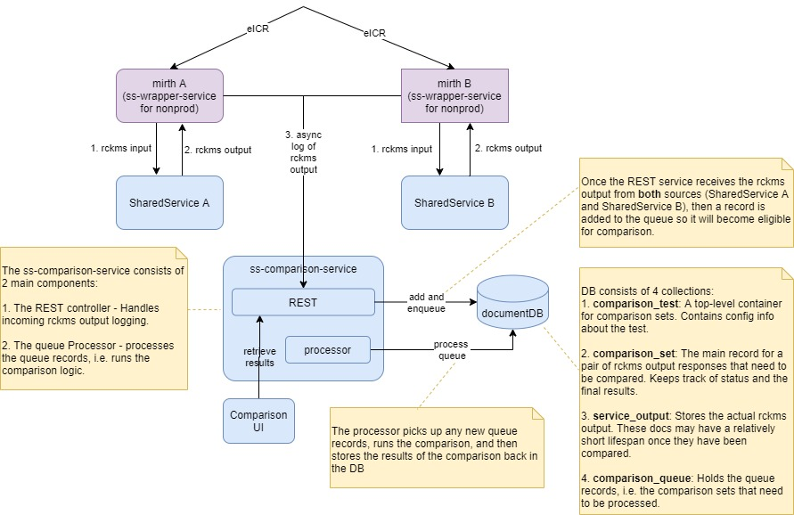

# SharedService Output Comparison Service

## Overview

The purpose of this service is to receive and store output from 2 different versions of the SharedService and then compare that
output and report any differences.

The individual SharedService outputs are submitted to this service separately and then "paired" by a unique identifier, called a
comparison set key.

Processing (comparing) is done asynchronously from the call to submit the output. REST endpoints are available for retrieving
details about comparisons performed, e.g. differences detected and stats.



### Core Concepts

* **Comparison Test**: Conceptually a `ComparisonTest` represents a batch of comparisons related to the testing of 2 separate
  versions of the SharedService. Each test is the high-level group that the individual comparisons (`ComparisonSet`) belong to. In
  addition, the `ComparisonTest` contains configuration information about the test such as how "control" output is identified and
  which comparison engine to use.


* **Comparison Set**: This is the main entity representing a set of output (`ServiceOutput`) files from the SharedService that
  should be compared. They are identified by a unique **comparison set key** given by the client at time of submission. <br/>Once
  compared, it also holds the result of the comparison, such as the overall status (pass vs fail) and any associated
  errors/differences.

    * **Service Output**: An individual output file from a SharedService call. Each comparison set has at least 2 outputs: a
      **control** output (aka "old/current") and a **variant** output (aka "new").

    * Comparison sets are can have the following status:
        * `INCOMPLETE`: Initial status when 2 or more outputs have not been received yet .
        * `PENDING`: A complete pair of outputs has been received and the comparison set is in the queue to be processed.
        * `PASS`: Comparison is complete and no differences were found.
        * `FAIL`: Comparison is complete and one or more differences were found.


* **Processing Queue**: This is a service that polls for newly received comparison sets and processes them, i.e. compares the output
  files associated to each comparison set. By default, each running instance of the ss-comparion-service is also running a
  processing queue.
    * Running multiple instances of the service is not an issue and each queue record is guaranteed to be processed only by one
      instance in that case. However, the processing queue can also be disabled.
    * Queue records are processed asynchronously. Each time the processing queue polls for ready records, it will process the batch,
      each asynchronously, until the queue is empty again.


* **Comparison Engine**: Each test defines a comparison engine which implements *how* the comparisons should be made. The idea is
  that each test will define its own unique comparison logic. For example, for the initial use of this service, the comparison
  engine was implemented to ignore several known differences between the control and variant output files. Future engines may use a
  simpler comparison whereby strict matching is enforced.

When a client submits the output from a SharedService call (see endpoint below), the following occurs:

1. A `ServiceOutput` record gets created in mongodb (`service_output` collection) along with an initial `ComparisonSet`
   record (`comparion_set` collection).

2. Once there are 2 or more `ServiceOutput` records for the **same** comparison set key, then the output is considered ready for
   comparison and that comparison set key is added into the queue (`comparison_queue` collection).

3. The `QueueProcesingService` picks up the queue record and kicks off the comparison process which compares the output and stores
   the results in the `ComparisonSet` record. If processed abnormally (i.e. an unexpected exception, not a comparison difference),
   then the queue record will be marked as an error. Otherwise, the queue record is marked complete (and by default it is physically
   removed from the `comparison_queue` collection).

<br/>

#### Comparison Results

When a comparison set is processed, it is given a high-level status of `PASS` or `FAIL`, the latter meaning that the comparison
yielded unexpected differences.

If the status is `FAIL`, then the `ComparisonSet` will also contain a non-empty array of `results`, where each result in the array
indicates a difference that was detected.

Example:

```json
{
  "id": "60358353669775607f42b3b5",
  "comparisonTestId": "202103",
  "comparisonSetKey": "45202ed6-acc7-48f0-854c-be959933bed8",
  "serviceOutputCount": 2,
  "createDate": "2021-02-23T22:36:03.306Z",
  "comparisonDate": "2021-02-23T22:36:14.258Z",
  "status": "FAIL",
  "results": [
    {
      "node": "/rckmsOutput[1]/jurisdiction[1]/locationRelevance[1]/codeSystem[1]/text()[1]",
      "description": "Expected text value '2.16.840.1.114222.4.5.274' but was '2.16.840.1.114222.4.5.275' - comparing <codeSystem ...>2.16.840.1.114222.4.5.274</codeSystem> at /rckmsOutput[1]/jurisdiction[1]/locationRelevance[1]/codeSystem[1]/text()[1] to <codeSystem ...>2.16.840.1.114222.4.5.275</codeSystem> at /rckmsOutput[1]/jurisdiction[1]/locationRelevance[1]/codeSystem[1]/text()[1] (DIFFERENT)",
      "type": "NODE_DIFF",
      "controlServiceOutputId": "6035835365246d08d3d3b880",
      "variantServiceOutputId": "6035835365246d08d3d3b890"
    }
  ]
}
```

Possible failure result `type` codes are:

* `NODE_DIFF`: The node values (e.g. element text or attribute value) were different. The `node` property will describe (in XPath)
  the offending node.
* `NODE_UNMATCHED`: A node was present only in one output. The `node` property will describe (in XPath)
  the offending node.
* `STATUS_DIFF`: The SharedService HTTP status codes were different. For example, if the control version responded with a HTTP 200 (
  ok) but the variant version responded with a HTTP 400 (bad request).
* `CONTROL_MISSING`: An output with a `source-id` matching the expected source id for a control document (as configured
  in `comparison_test`) was never received.
* `VARIANT_MISSING`: A variant output was never received.
* `OTHER`: All other differences.

---

## Endpoints

### Submitting SharedService output for comparison

`POST`
to `/ss-comparison-service/v1/comparison-tests/{comparison-test-id}/comparison-sets/{comparison-set-key}/output/{source-id}`<p/>

* `{comparison-test-id}`: Should be set to a valid `ComparisonTest` ID that exists in the `comparison_test` collection in mongo.
* `{comparison-set-id}`: The unique ID that identifies a set of output files. This value must be the same for the submission of both
  the control and variant outputs.

* `{source-id}`: A unique identifier for the source of the file, i.e. for the control or variant output. For example, when
  submitting the output for the control version of the SharedService, it might be "RCKMS_OLD", and for the variant version it might
  be "RCKMS_NEW". Note that whatever value is used for the control version, must also be configured in the `comparison_test`
  document in mongo corresponding with the test ID being used.

The body of the `POST` should be in `json` following this format:

```json
{
  "serviceStatus": 200,
  "serviceOutput": "<?xml version=\"1.0\" encoding=\"UTF-8\" standalone=\"yes\"?><rckmsOutput xmlns=\"org.cdsframework.rckms.output\" ...</rckmsOutput>"
}
```

* `serviceStatus`: Set to the HTTP status code from the SharedService response
* `serviceOutput`: Set to the response body received from the SharedService, e.g. for non-error responses, it would be
  the `rckmsOutput` XML as shown above.

For example, when an eICR is received in AIMS, a unique comparison set key (something that uniquely identifies the eICR input) would
need to be sent as part of each submission to the comparison service. Assuming the test we are running is called "
202103" and that unique comparison set key is "a1b2c3d4e5f", then the following 2 POST calls would be needed:

1. For the control: `/ss-comparison-service/v1/comparison-tests/202103/comparison-sets/a1b2c3d4e5f/output/RCKMS_OLD`, with a body as
   described above.
2. For the variant: `/ss-comparison-service/v1/comparison-tests/202103/comparison-sets/a1b2c3d4e5f/output/RCKMS_NEW`, with a body as
   described above.

Note that the order in which those 2 calls are made does **not** matter.

### Management Endpoints

#### Retrieve All ComparisonTests

`GET /ss-comparison-service/v1/management/comparison-tests`

#### Retrieve a specific ComparisonTest by ID

`GET /ss-comparison-service/v1/management/comparison-tests/{id}`

#### Add a new ComparisonTest

`POST /ss-comparison-service/v1/management/comparison-tests`
With a body like:

```json
{
  "id": "202103",
  "description": "test",
  "controlSourceId": "RCKMS_OLD",
  "comparisonEngineId": "202103"
}
```

#### Retrieve a ComparisonSet by its comparison set key

`GET /ss-comparison-service/v1/management/comparison-sets/{comparison-set-key}`

#### Retrieve a ComparisonSet by its comparison set key, including details

`GET /ss-comparison-service/v1/management/comparison-sets/{comparison-set-key}/details`

Note that this differs from the endpoint above only in that it includes more details such as links to retrieve the rckmsOutput XML
associated to the comparison.

#### Find all ComparisonSets for a specific ComparisonTest and matching given filters

`GET /ss-comparison-service/v1/management/comparison-tests/{comparison-test-id}/comparison-sets`

The following query params can be set to control the results:

* `status`: Set to the status of the ComparisonSet, either `PASS` or `FAIL`, e.g. `status=FAIL`
* `startDate`: Specify a minimum submission date, in ISO-8601 format, e.g. `startDate=2021-02-19T23:31:42.121Z`
* `endDate`: Specify a maximum submission date, in ISO-8601 format, e.g. `endDate=2021-02-19T23:31:42.121Z`
* `sort`: Specify the field to sort by, e.g. `sort=createDate`. Optionally provide a sort direction as `asc|desc`,
  e.g. `sort=createDate,desc`. Create a composite sort by including the `sort` param multiple times.

#### Update a ComparisonSet

`PUT /ss-comparison-service/v1/management/comparison-sets/{comparison-set-key}` with a body consisting of the ComparisonSet object,
e.g.

```json
{
  "id": "602175f7669775607f42a4ed",
  "comparisonTestId": "202103",
  "comparisonSetKey": "1234567",
  "serviceOutputCount": 2,
  "createDate": "2021-02-08T17:33:47.213Z",
  "comparisonDate": "2021-02-08T23:14:43.472Z",
  "status": "PASS",
  "results": [],
  "serviceOutputs": null
}
```

#### Retrieve all ServiceOutput for a ComparisonSet

`GET /ss-comparison-service/v1/management/comparison-sets/{comparison-set-key}/output`

#### Retrieve a single ServiceOutput by ID

`GET /ss-comparison-service/v1/management/comparison-sets/{comparison-set-key}/output/{output-id}`

#### Retrieve just the XML payload from a single ServiceOutput

`GET /ss-comparison-service/v1/management/comparison-sets/{comparison-set-key}/output/{output-id}/xml`

### Pagination Support

Note that most management endpoints that return an array of objects also support pagination control. The following query params can
be supplied:

* `page`: The page index (0-based) to retrieve, e.g. `page=0` for the first page
* `page-size`: The max count of objects to return for the page, e.g. `page-size=100`. The default is 50, whn not explicitly
  specified, and the max is 1000.

### Statistics Endpoints

#### Retrieve stats for a ComparisonTest

`GET /ss-comparison-service/v1/management/comparison-tests/{comparison-test-id}/summary` will provide a summary of the test
including pas/fail stats, output counts, etc. The following filter query params are supported:

* `startDate`: Specify a minimum submission date, in ISO-8601 format, e.g. `startDate=2021-02-19T23:31:42.121Z`
* `endDate`: Specify a maximum submission date, in ISO-8601 format, e.g. `endDate=2021-02-19T23:31:42.121Z`

#### Retrieve stats for the comparison queue (WIP/experimental)

`GET /ss-comparison-service/v1/queue/stats` will provide stats on the queue such as processing time, polling time, count of queue
records, etc.

---

## Deployment Configuration

### Spring Profiles

When running in **nonprod**, activate the `nonprod` spring profile by setting the `spring_profiles_active=nonprod` env variable or
by passing it as a JVM system property, e.g. `-Dspring.profiles.active=nonprod`.

That profile will configure the service to ignore certain data discrepancies that exist only when comparing one nonprod env to
another nonprod env such as training vs demo.

### Env variables

The following variables **must** be set by the runtime environment:

* `mongodb.url`: The mongodb/documentDb connection URI

Optional variables:

* `management-base-url`: The base URL for the comparison-service management endpoints,
  e.g. `http://localhost:8180/ss-comparison-service/v1/management`. This should be the external-facing URL because it is used to
  construct resource URLs in the REST service output for the client to use directly. This may be **required** in certain cases, like
  if behind a reverse proxy.
* `service-output-expiration`: Defines how long to keep `service_output` documents **once they've been compared**. By default it is
  set to 10 days. After this expiration, documents will be automatically deleted.
* `processor.enabled`: Enable/Disable the queue processor. Default is `true`.
* `processor.delete-on-complete`: If `true` then queue records in `comparison_queue` will be deleted once they processed (without
  error). The default is `true` because it keeps the records in the queue as small as possible. Note that errors are never deleted.

See the `application.yml` for all possible properties that can be overridden.
